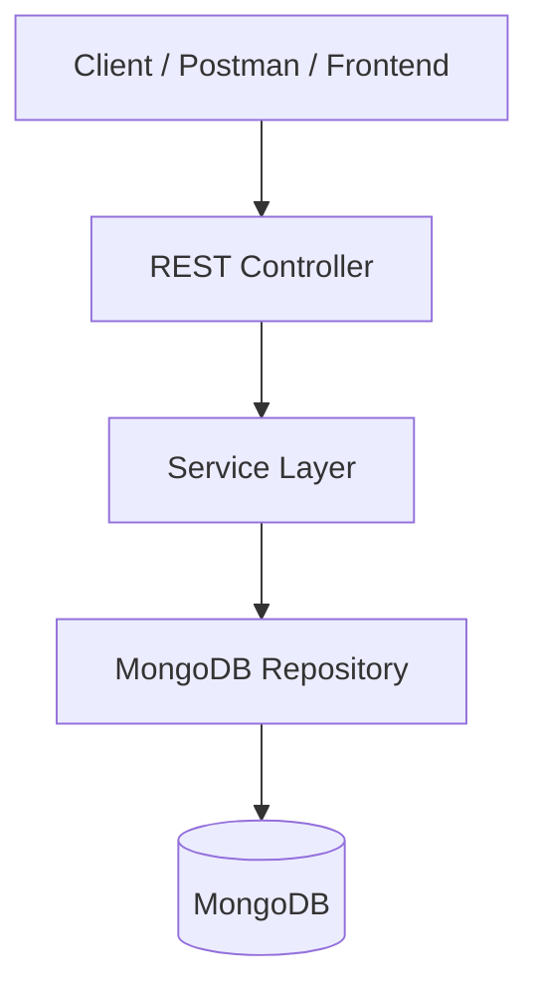

# 🎬 AniVault

<p align="center">
  
  
  
  
</p>

A personal **media library and tracking REST API** built with **Spring Boot** and **MongoDB** for organizing Anime, Movies, TV Shows, Cartoons, and other media.

AniVault allows users to maintain their own collections, track watch status, organize titles with tags, and store useful information and links for each title.

---

## 🛠️ Technical Stack

| Category           | Technology              | Purpose                          |
| :----------------- | :---------------------- | :------------------------------- |
| ☕ **Language**     | **Java 21**             | Core application development     |
| 🚀 **Framework**   | **Spring Boot**         | REST API & backend development   |
| 🗄️ **Database**   | **MongoDB**             | NoSQL document storage           |
| 🔗 **Data Access** | **Spring Data MongoDB** | MongoDB repository & query layer |
| 📦 **Build Tool**  | **Maven**               | Dependency management & builds   |
| ⚡ **Utilities**    | **Lombok**              | Boilerplate code reduction       |
| ✅ **Validation**   | **Jakarta Validation**  | Request data validation          |

---

## ✨ Core Features

* 🎞️ **Media Management** — Manage Anime, Movies, TV Shows, and Cartoons.
* 👤 **User Collections** — Each user maintains their own personal library.
* 📌 **Watch Status** — Track planned, ongoing, completed, on-hold, or dropped titles.
* 🏷️ **Tags** — Organize media using custom tags and categories.
* ⭐ **Ratings** — Store personal ratings for titles.
* 🔗 **External Links** — Keep useful links associated with each title.
* 🔎 **Search & Filtering** — Find media by name, type, status, tags, and other properties.
* 📄 **Pagination & Sorting** — Efficiently browse larger collections.

---

## 🏗️ Architecture



The application follows a clean layered architecture:

```text
Controller
    ↓
Service
    ↓
Repository
    ↓
MongoDB
```

---

## 🗄️ Data Model

### `User`

| Field      | Type       | Description            |
| :--------- | :--------- | :--------------------- |
| `id`       | `ObjectId` | Unique user identifier |
| `username` | `String`   | User's username        |
| `email`    | `String`   | User's email           |

### `Media`

| Field           | Type       | Description                           |
| :-------------- | :--------- | :------------------------------------ |
| `id`            | `ObjectId` | Unique media identifier               |
| `userId`        | `ObjectId` | Owner of the media entry              |
| `name`          | `String`   | Media title                           |
| `description`   | `String`   | Short description                     |
| `type`          | `Enum`     | Anime, Movie, TV Show, Cartoon        |
| `status`        | `Enum`     | Planned, In Progress, Completed, etc. |
| `rating`        | `Double`   | Personal rating                       |
| `coverImageUrl` | `String`   | Cover/poster URL                      |
| `createdAt`     | `DateTime` | Creation timestamp                    |
| `updatedAt`     | `DateTime` | Last update timestamp                 |

---

## 🌐 API

### Media

| Method   | Endpoint          | Description                 |
| :------- | :---------------- | :-------------------------- |
| `POST`   | `/api/media`      | Add a new media entry       |
| `GET`    | `/api/media`      | Get user's media collection |
| `GET`    | `/api/media/{id}` | Get a specific media entry  |
| `PUT`    | `/api/media/{id}` | Update a media entry        |
| `DELETE` | `/api/media/{id}` | Delete a media entry        |

### Categories

```http
GET /api/anime
GET /api/movies
GET /api/tv-shows
GET /api/cartoons
```

### Future Search & Filtering

```http
GET /api/media/search?query=naruto
GET /api/anime?status=COMPLETED
GET /api/media?tag=action
GET /api/movies?sort=rating,desc
```

---

## 📂 Project Structure

```text
src/main/java/com/anivault/
├── controller/
│   └── MediaController.java
│
├── service/
│   └── MediaService.java
│
├── repository/
│   └── MediaRepository.java
│
├── entity/
│   ├── Media.java
│   └── User.java
│
├── dto/
│   ├── MediaRequest.java
│   └── MediaResponse.java
│
├── exception/
│   ├── ResourceNotFoundException.java
│   └── GlobalExceptionHandler.java
│
└── enums/
    ├── MediaType.java
    └── MediaStatus.java
```

---

## 🚀 Development Roadmap

* [x] Project initialization
* [ ] User & Media models
* [ ] Basic CRUD REST API
* [ ] Request validation
* [ ] Exception handling
* [ ] Anime / Movie / TV Show / Cartoon filtering
* [ ] Search
* [ ] Pagination & sorting
* [ ] Tags
* [ ] External links
* [ ] Watch progress
* [ ] User authentication
* [ ] JWT & authorization
* [ ] Unit & integration testing
* [ ] Swagger / OpenAPI documentation

---

## 🎯 Project Goal

AniVault is being developed as a hands-on **Spring Boot backend project**, gradually evolving from a simple CRUD application into a structured multi-user media management platform.

The primary focus is learning and implementing:

```text
REST APIs
    ↓
Spring Boot Architecture
    ↓
MongoDB
    ↓
DTOs & Validation
    ↓
Exception Handling
    ↓
Search & Filtering
    ↓
Authentication & Authorization
    ↓
Testing & Documentation
```

> 🚧 **Status: Active Development**
>
> AniVault is currently in its initial development phase.
